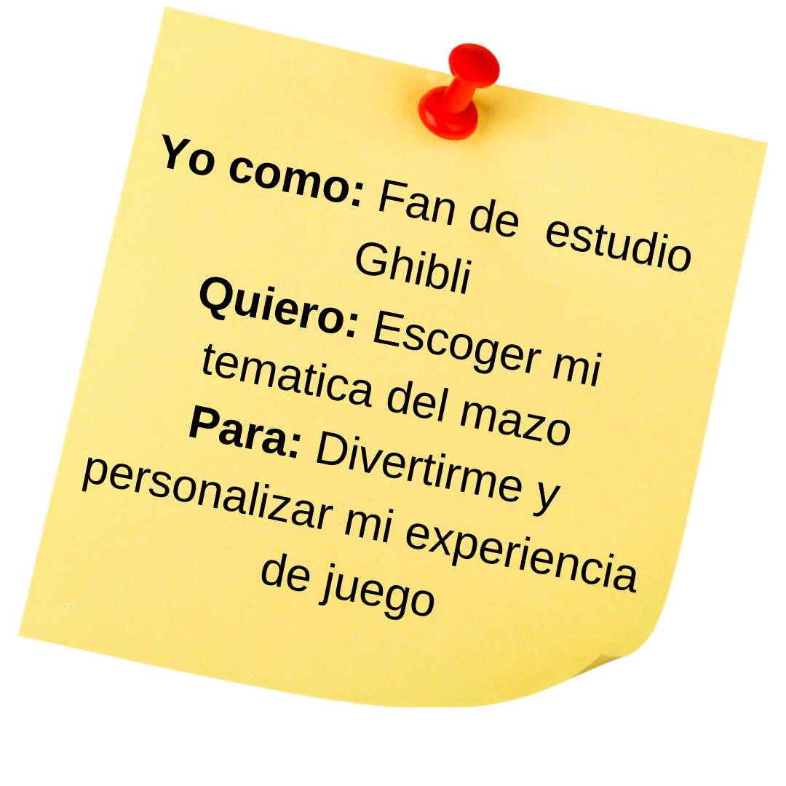
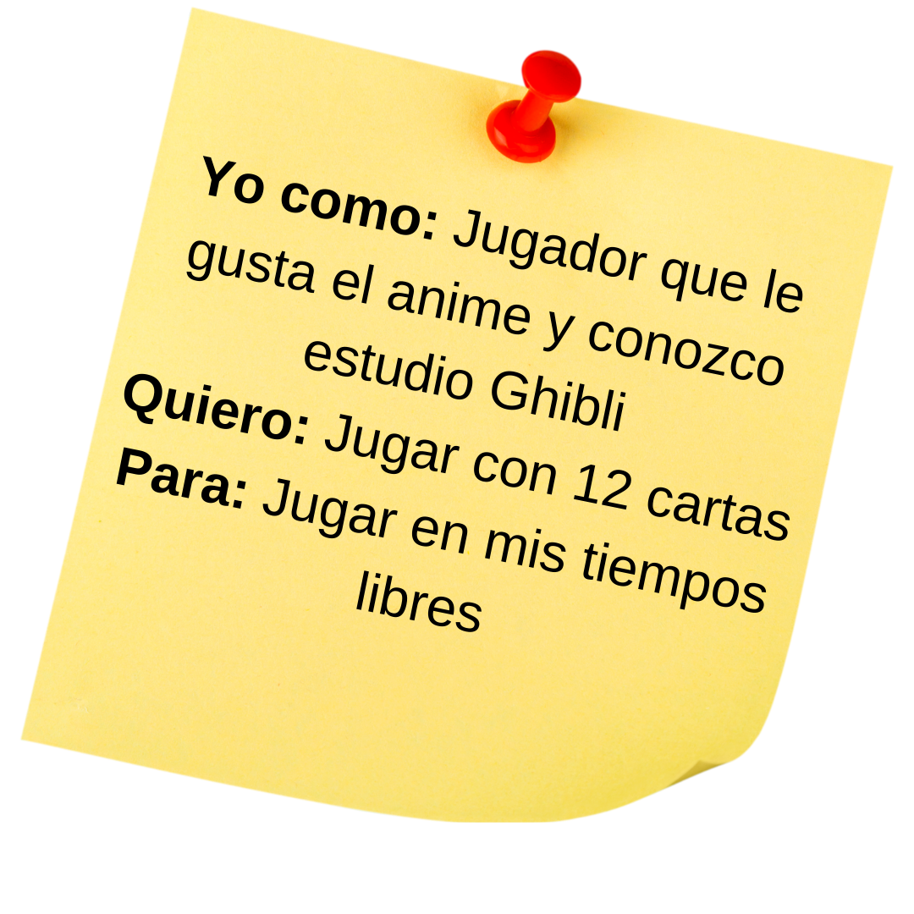
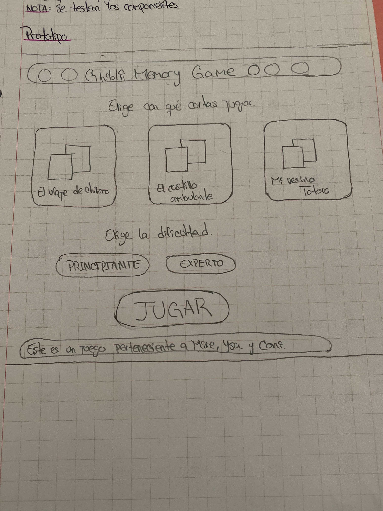

# Memory Match Game Estudio Ghibli

## Definición del producto
Memory Match de estudio Ghibli es un juego de memoria  inspirado en las películas de Estudio Ghibli que consiste en encontrar pares de cartas destapandolas de 2 en 2 hasta encontrar todos los pares. El juego está pensado para un público joven adulto y para jugar de manera individual en distintos dispositivos electrónicos como notebook o teléfono celular. 

## Historias de usuario
Las historias de usuario nacen después de realizar un research de usuario. Para ello elaboramos esta encuesta en Google Forms [_disponible aquí_](https://docs.google.com/forms/d/107VnGh2MsOVBne_0u3mY7cuWHa8uTwYJt4-8xZxs6oU/viewform?edit_requested=true) y a partir de los resultados caracterizamos al usuario objetivo:

¿Quiénes son los principales usuarios de producto?
Usuarios de 30 años promedio fans de estudio Ghibli

#### Prototipo de baja fidelidad

#### Prototipo de alta fidelidad

#### Testeos de usabilidad
1.- Mujer de 37 años: Indica que le gusta el aspecto de la página aunque desconoce el concepto, expresa que es muy intuitivo diciendo que entiende cada ícono y botón que presenta. Se muestra interesada en memorizar las cartas antes de ser ocultadas y finaliza sentenciando que se entretuvo y cumple con su expectativa acerca de un juego de memoria clásico.

## Índice

* [1. Preámbulo](#1-preámbulo)
* [2. Resumen del proyecto](#2-resumen-del-proyecto)
* [3. Objetivos de aprendizaje](#3-objetivos-de-aprendizaje)
* [4. Consideraciones generales](#4-consideraciones-generales)
* [5. Criterios de aceptación mínimos del proyecto](#5-criterios-de-aceptación-mínimos-del-proyecto)
* [6. Hacker edition](#6-hacker-edition)
* [7. Consideraciones técnicas](#7-consideraciones-técnicas)
* [8. Pistas, tips y lecturas complementarias](#8-pistas-tips-y-lecturas-complementarias)
* [9. Checklist](#9-checklist)

***

## 1. Preámbulo

El juego [_Memory Match_](https://en.wikipedia.org/wiki/Concentration_(card_game)),
también conocido como _Concentration_, _Match Match_, _Match Up_, _Memory_,
entre otros, es un juego de cartas en el que todas las cartas se ponen cara
abajo sobre una superficie y se le dan la vuelta a dos cartas en cada turno. El
objetivo del juego es destapar parejas de cartas que coincidan.

Ejemplos:

* [Santa Tracker de Google](https://santatracker.google.com/matching.html)
* [Match The Memory](https://matchthememory.com/play)

## 2. Resumen del proyecto

En este proyecto construirás una versión _web_ del juego _Memory Match_, en la
que una jugadora pueda jugar sola, en el navegador.

El objetivo principal de este proyecto es que aprendas a diseñar y construir una
interfaz web basada en data e interacción con la usuaria.

## 3. Objetivos de aprendizaje

Reflexiona y luego marca los objetivos que has llegado a entender y aplicar en tu proyecto. Piensa en eso al decidir tu estrategia de trabajo.

### HTML

- [ ] **Uso de HTML semántico**

  

Links

  * [HTML semántico](https://curriculum.laboratoria.la/es/topics/html/02-html5/02-semantic-html)
  * [Semantics - MDN Web Docs Glossary](https://developer.mozilla.org/en-US/docs/Glossary/Semantics#Semantics_in_HTML)

### CSS

- [ ] **Uso de selectores de CSS**

  

Links

  * [Intro a CSS](https://curriculum.laboratoria.la/es/topics/css/01-css/01-intro-css)
  * [CSS Selectors - MDN](https://developer.mozilla.org/es/docs/Web/CSS/CSS_Selectors)

- [ ] **Modelo de caja (box model): borde, margen, padding**

  

Links

  * [Box Model & Display](https://curriculum.laboratoria.la/es/topics/css/01-css/02-boxmodel-and-display)
  * [The box model - MDN](https://developer.mozilla.org/en-US/docs/Learn/CSS/Building_blocks/The_box_model)
  * [Introduction to the CSS box model - MDN](https://developer.mozilla.org/en-US/docs/Web/CSS/CSS_Box_Model/Introduction_to_the_CSS_box_model)
  * [CSS display - MDN](https://developer.mozilla.org/pt-BR/docs/Web/CSS/display)
  * [display - CSS Tricks](https://css-tricks.com/almanac/properties/d/display/)

- [ ] **Uso de flexbox en CSS**

  

Links

  * [A Complete Guide to Flexbox - CSS Tricks](https://css-tricks.com/snippets/css/a-guide-to-flexbox/)
  * [Flexbox Froggy](https://flexboxfroggy.com/#es)
  * [Flexbox - MDN](https://developer.mozilla.org/en-US/docs/Learn/CSS/CSS_layout/Flexbox)

### Web APIs

- [ ] **Uso de selectores del DOM**

  

Links

  * [Manipulación del DOM](https://curriculum.laboratoria.la/es/topics/browser/02-dom/03-1-dom-methods-selection)
  * [Introducción al DOM - MDN](https://developer.mozilla.org/es/docs/Web/API/Document_Object_Model/Introduction)
  * [Localizando elementos DOM usando selectores - MDN](https://developer.mozilla.org/es/docs/Web/API/Document_object_model/Locating_DOM_elements_using_selectors)

- [ ] **Manejo de eventos del DOM (listeners, propagación, delegación)**

  

Links

  * [Introducción a eventos - MDN](https://developer.mozilla.org/es/docs/Learn/JavaScript/Building_blocks/Events)
  * [EventTarget.addEventListener() - MDN](https://developer.mozilla.org/es/docs/Web/API/EventTarget/addEventListener)
  * [EventTarget.removeEventListener() - MDN](https://developer.mozilla.org/es/docs/Web/API/EventTarget/removeEventListener)
  * [El objeto Event](https://developer.mozilla.org/es/docs/Web/API/Event)

- [ ] **Manipulación dinámica del DOM**

  

Links

  * [Introducción al DOM](https://developer.mozilla.org/es/docs/Web/API/Document_Object_Model/Introduction)
  * [Node.appendChild() - MDN](https://developer.mozilla.org/es/docs/Web/API/Node/appendChild)
  * [Document.createElement() - MDN](https://developer.mozilla.org/es/docs/Web/API/Document/createElement)
  * [Document.createTextNode()](https://developer.mozilla.org/es/docs/Web/API/Document/createTextNode)
  * [Element.innerHTML - MDN](https://developer.mozilla.org/es/docs/Web/API/Element/innerHTML)
  * [Node.textContent - MDN](https://developer.mozilla.org/es/docs/Web/API/Node/textContent)

### JavaScript

- [ ] **Diferenciar entre tipos de datos primitivos y no primitivos**

- [ ] **Arrays (arreglos)**

  

Links

  * [Arreglos](https://curriculum.laboratoria.la/es/topics/javascript/04-arrays)
  * [Array - MDN](https://developer.mozilla.org/es/docs/Web/JavaScript/Reference/Global_Objects/Array/)
  * [Array.prototype.sort() - MDN](https://developer.mozilla.org/es/docs/Web/JavaScript/Reference/Global_Objects/Array/sort)
  * [Array.prototype.forEach() - MDN](https://developer.mozilla.org/es/docs/Web/JavaScript/Reference/Global_Objects/Array/forEach)
  * [Array.prototype.map() - MDN](https://developer.mozilla.org/es/docs/Web/JavaScript/Reference/Global_Objects/Array/map)
  * [Array.prototype.filter() - MDN](https://developer.mozilla.org/es/docs/Web/JavaScript/Reference/Global_Objects/Array/filter)
  * [Array.prototype.reduce() - MDN](https://developer.mozilla.org/es/docs/Web/JavaScript/Reference/Global_Objects/Array/Reduce)

- [ ] **Objetos (key, value)**

  

Links

  * [Objetos en JavaScript](https://curriculum.laboratoria.la/es/topics/javascript/05-objects/01-objects)

- [ ] **Variables (declaración, asignación, ámbito)**

  

Links

  * [Valores, tipos de datos y operadores](https://curriculum.laboratoria.la/es/topics/javascript/01-basics/01-values-variables-and-types)
  * [Variables](https://curriculum.laboratoria.la/es/topics/javascript/01-basics/02-variables)

- [ ] **Uso de condicionales (if-else, switch, operador ternario, lógica booleana)**

  

Links

  * [Estructuras condicionales y repetitivas](https://curriculum.laboratoria.la/es/topics/javascript/02-flow-control/01-conditionals-and-loops)
  * [Tomando decisiones en tu código — condicionales - MDN](https://developer.mozilla.org/es/docs/Learn/JavaScript/Building_blocks/conditionals)

- [ ] **Uso de bucles/ciclos (while, for, for..of)**

  

Links

  * [Bucles (Loops)](https://curriculum.laboratoria.la/es/topics/javascript/02-flow-control/02-loops)
  * [Bucles e iteración - MDN](https://developer.mozilla.org/es/docs/Web/JavaScript/Guide/Loops_and_iteration)

- [ ] **Funciones (params, args, return)**

  

Links

  * [Funciones (control de flujo)](https://curriculum.laboratoria.la/es/topics/javascript/02-flow-control/03-functions)
  * [Funciones clásicas](https://curriculum.laboratoria.la/es/topics/javascript/03-functions/01-classic)
  * [Arrow Functions](https://curriculum.laboratoria.la/es/topics/javascript/03-functions/02-arrow)
  * [Funciones — bloques de código reutilizables - MDN](https://developer.mozilla.org/es/docs/Learn/JavaScript/Building_blocks/Functions)

- [ ] **Pruebas unitarias (unit tests)**

  

Links

  * [Empezando con Jest - Documentación oficial](https://jestjs.io/docs/es-ES/getting-started)

- [ ] **Módulos de ECMAScript (ES Modules)**
=======
¿Cuáles son los objetivos de estos usuarios en relación con el producto?
quieren jugar el memory match en sus tiempos libres y que sea un juego desafiante con 12 o 16 cartas.

¿Cuáles son los componentes principales de la interfaz y por qué?
pantalla de inicio: bienvenida al juego, seleccionar opciones de mazo con tematicas de peliculas : porque el usuario quiere poder escoger su película favorita

¿Cuándo utilizan o utilizarían el producto?
En sus tiempos libres y en multiples dispositivos

### Criterios de aceptación:
* Diseña 3 temáticas de mazo
* El usuario debe seleccionar una categoría con un click 
* Se despliega el memory game según la temática elegida 
* Comienza el juego 

### Definición de terminado
* Se crea un archivo de categories.js 
* Se implementan 3 set de cartas según la temática seleccionada: La princesa Mononoke, El castillo ambulante, Mi vecino Totoro
* Se crean botones que al click despliegan la temática de cada set de cartas 

### Criterios de aceptación:
* Escoger 1 imagen para cada tarjeta según la temática del juego 
* Se despliegan 12 cartas barajadas en el tablero 
* Cada carta tiene un par en el tablero  

### Definición de terminado
* Importar las imagénes a la carpeta data
* Duplicar las imágenes con concat 
* Barajar las cartas creando una función shuffle 

## Diseño de la Interfaz de Usuario
#### Prototipo de baja fidelidad

#### Prototipo de alta fidelidad

[_Link de prototipo de Figma_](https://www.figma.com/file/iyYqH510cBTQekA7fVLXn2/Ghibli's-Memory-Match-Game?node-id=0%3A1)

#### Testeos de usabilidad
